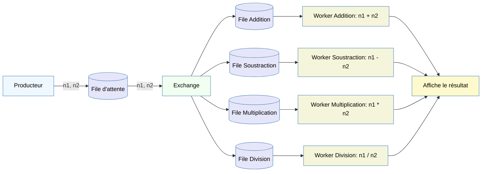

```mermaid
graph LR
    A[Producteur] -->|n1, n2| B[(File d'attente)]
    B -->|n1, n2| H[Exchange]
    H --> D2[(File Addition)]
    H --> E2[(File Soustraction)]
    H --> F2[(File Multiplication)]
    H --> G2[(File Division)]
    D2 --> D[Worker Addition: n1 + n2]
    E2 --> E[Worker Soustraction: n1 - n2]
    F2 --> F[Worker Multiplication: n1 * n2]
    G2 --> G[Worker Division: n1 / n2]
    D --> I[Affiche le résultat]
    E --> I
    F --> I
    G --> I

    style A fill:#f0f8ff,stroke:#4682b4,color:#000
    style B fill:#e6e6fa,stroke:#4682b4,color:#000
    style H fill:#f0fff0,stroke:#4682b4,color:#000
    style D2 fill:#e6e6fa,stroke:#4682b4,color:#000
    style E2 fill:#e6e6fa,stroke:#4682b4,color:#000
    style F2 fill:#e6e6fa,stroke:#4682b4,color:#000
    style G2 fill:#e6e6fa,stroke:#4682b4,color:#000
    style D fill:#f5f5dc,stroke:#4682b4,color:#000
    style E fill:#f5f5dc,stroke:#4682b4,color:#000
    style F fill:#f5f5dc,stroke:#4682b4,color:#000
    style G fill:#f5f5dc,stroke:#4682b4,color:#000
    style I fill:#fffacd,stroke:#4682b4,color:#000
```
